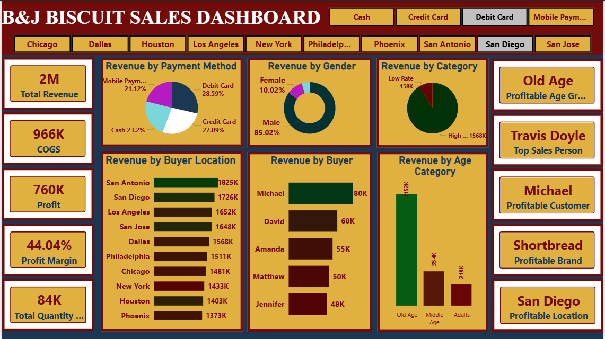

# PowerBI-Biscuit-Sales-Dashboard
A Power BI dashboard analyzing sales, demographics, and profitability for B&amp;J Biscuit.
# B&J Biscuit Sales & Business Analysis Dashboard 📊

## 📝 Project Overview
This project involves the creation of a comprehensive Sales and Business Analysis Dashboard for B&J Biscuit using Power BI. The goal of this dashboard is to provide actionable insights into revenue distribution, customer demographics, geographic performance, and overall profitability to enable quick and informed decision-making.

## 🛠️ Tech Stack & Tools
* **Tool:** Power BI
* **Techniques Used:** Data Modeling, DAX (Data Analysis Expressions), Data Transformation (Power Query), Interactive Visualizations

## 🎯 Key Objectives
* Analyze revenue distribution by product price category, age group, gender, and payment method.
* Evaluate profitability across brands, locations, customers, and salespersons.
* Track sales performance metrics including Total Revenue, COGS, Total Profit, and Profit Margin.
* Identify profitable segments to optimize future marketing and sales strategies.

## 💡 Key Business Insights
1. **Financial Performance:** Generated a healthy **44.04% Profit Margin** on total revenue of **$2M** (Total Profit: $760K).
2. **Top Performers:** * **Location:** San Diego is the most profitable region.
   * **Brand:** Shortbread is the leading and most profitable biscuit brand.
   * **Salesperson:** Travis Doyle is the top-performing sales representative.
3. **Customer Demographics:** The **"Old Age"** category represents the most profitable customer segment, indicating a strong target audience for premium or loyalty marketing.
4. **Transaction Preferences:** Payment methods are well-distributed, with Debit Cards (28.59%) and Credit Cards (27.09%) being the most popular.

## 📸 Dashboard Preview
 

## 🚀 How to Use This Repository
1. Download the `.pbix` file.
2. Open it in Power BI Desktop.
3. Interact with the filters (Cash, Credit Card, Location, etc.) to see dynamic updates across all KPIs and visuals.
